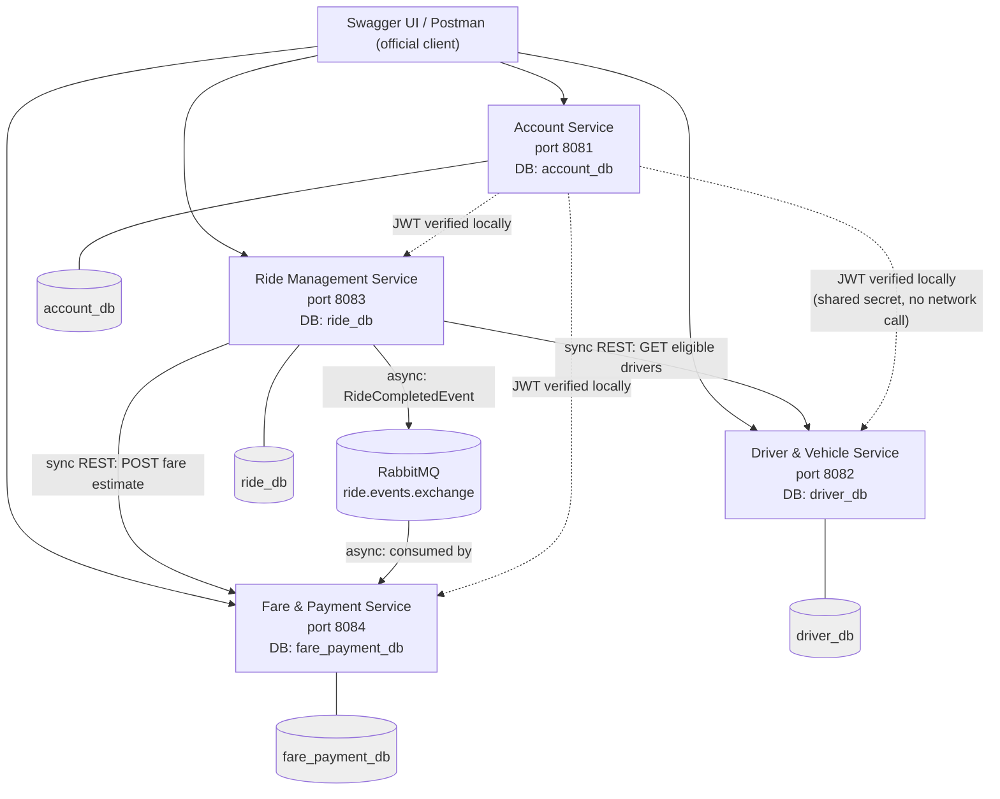

# RideLink Architecture Diagram

Paste this into [mermaid.live](https://mermaid.live) to render and export as
a PNG/SVG for the technical report.

**Key points to reference in the report:**
- Each service owns its own database; there are no cross-service joins or shared schemas.
- Authentication is stateless: the Account Service issues a JWT, and every other service verifies it locally using a shared secret rather than calling Account Service on every request.
- Two distinct interservice communication styles are used, each justified by its context: synchronous REST for calls that need an immediate answer (driver matching, fare estimate), and asynchronous messaging for the ride-completion → payment handoff, which is not on the critical path of the driver's action.
