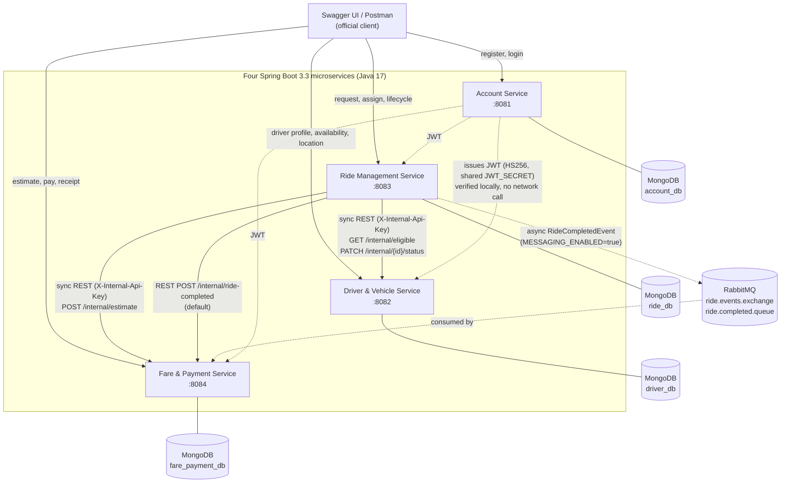

# RideLink Architecture Diagram

Paste the diagram into [mermaid.live](https://mermaid.live) to render and export it as PNG/SVG for the report.

```mermaid
flowchart TB
    Client["Swagger UI / Postman<br/>(official client)"]

    Client -->|"register, login"| ACC
    Client -->|"driver profile, availability, location"| DRV
    Client -->|"request, assign, lifecycle"| RIDE
    Client -->|"estimate, pay, receipt"| FARE

    subgraph Services["Four Spring Boot 3.3 microservices (Java 17)"]
        ACC["Account Service<br/>:8081"]
        DRV["Driver & Vehicle Service<br/>:8082"]
        RIDE["Ride Management Service<br/>:8083"]
        FARE["Fare & Payment Service<br/>:8084"]
    end

    RIDE -- "sync REST (X-Internal-Api-Key)<br/>GET /internal/eligible<br/>PATCH /internal/{id}/status" --> DRV
    RIDE -- "sync REST (X-Internal-Api-Key)<br/>POST /internal/estimate" --> FARE
    RIDE -- "REST POST /internal/ride-completed<br/>(default)" --> FARE
    RIDE -. "async RideCompletedEvent<br/>(MESSAGING_ENABLED=true)" .-> MQ[("RabbitMQ<br/>ride.events.exchange<br/>ride.completed.queue")]
    MQ -. "consumed by" .-> FARE

    ACC -. "issues JWT (HS256, shared JWT_SECRET)<br/>verified locally, no network call" .-> DRV
    ACC -. "JWT" .-> RIDE
    ACC -. "JWT" .-> FARE

    ACC --- ACCDB[("MongoDB<br/>account_db")]
    DRV --- DRVDB[("MongoDB<br/>driver_db")]
    RIDE --- RIDEDB[("MongoDB<br/>ride_db")]
    FARE --- FAREDB[("MongoDB<br/>fare_payment_db")]
```

**Key points for the report**

| Service | Owns (data) | Depends on |
|---|---|---|
| Account | accounts, roles, account status | — (issues JWTs) |
| Driver & Vehicle | driver profiles with embedded vehicle, availability, location | — |
| Ride Management | rides and their status history | Driver & Vehicle, Fare & Payment |
| Fare & Payment | payments, fare breakdowns, receipts | — (receives completed rides) |

- **Data ownership:** four separate MongoDB databases. No service reads another's database; they share only
  stable identifiers (`userId` from Account, `driverId` from Driver & Vehicle, `rideId` from Ride Management).
- **Stateless authentication:** Account issues the JWT; every service verifies it with the shared secret, so
  Account is not on the request path of the other services.
- **Low coupling:** only Ride Management calls other services; the other three do not call anyone.
- **Two communication styles:** synchronous REST where the caller needs the answer immediately (estimate,
  driver matching and reservation), and a completion hand-off that can run over REST or asynchronously over
  RabbitMQ so payment set-up never blocks or fails the driver's "complete ride" action.
