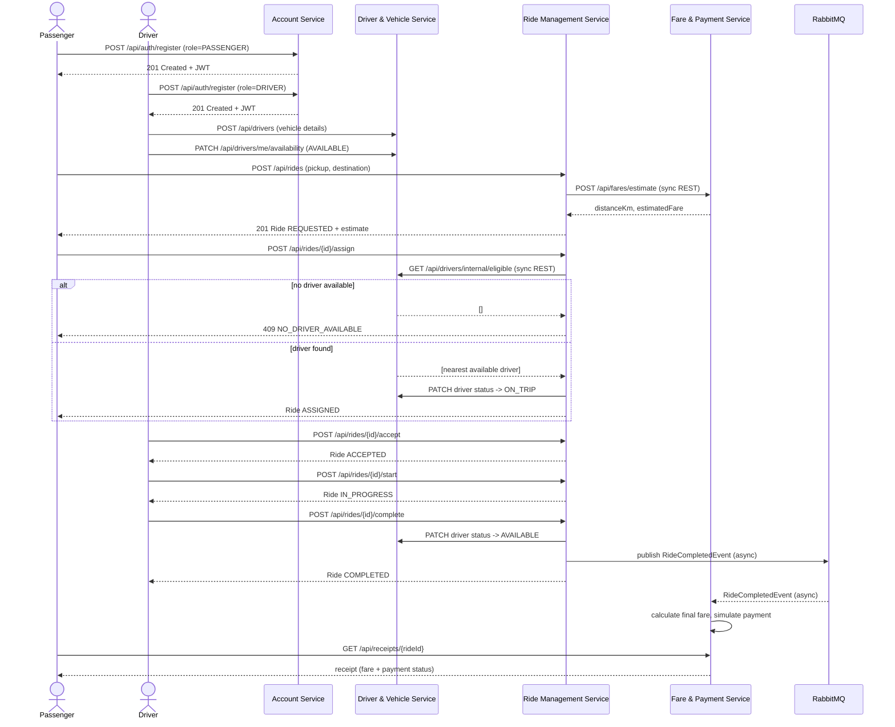

# RideLink Sequence Diagram — Full Ride Lifecycle

Paste into [mermaid.live](https://mermaid.live) to render and export for the report.

```mermaid
sequenceDiagram
    actor Passenger
    actor Driver
    participant ACC as Account Service
    participant DRV as Driver & Vehicle Service
    participant RIDE as Ride Management Service
    participant FARE as Fare & Payment Service
    participant MQ as RabbitMQ

    Passenger->>ACC: POST /api/auth/register (role=PASSENGER)
    ACC-->>Passenger: 201 Created + JWT

    Driver->>ACC: POST /api/auth/register (role=DRIVER)
    ACC-->>Driver: 201 Created + JWT
    Driver->>DRV: POST /api/drivers (vehicle details)
    Driver->>DRV: PATCH /api/drivers/me/availability (AVAILABLE)

    Passenger->>RIDE: POST /api/rides (pickup, destination)
    RIDE->>FARE: POST /api/fares/estimate (sync REST)
    FARE-->>RIDE: distanceKm, estimatedFare
    RIDE-->>Passenger: 201 Ride REQUESTED + estimate

    Passenger->>RIDE: POST /api/rides/{id}/assign
    RIDE->>DRV: GET /api/drivers/internal/eligible (sync REST)
    alt no driver available
        DRV-->>RIDE: []
        RIDE-->>Passenger: 409 NO_DRIVER_AVAILABLE
    else driver found
        DRV-->>RIDE: [nearest available driver]
        RIDE->>DRV: PATCH driver status -> ON_TRIP
        RIDE-->>Passenger: Ride ASSIGNED
    end

    Driver->>RIDE: POST /api/rides/{id}/accept
    RIDE-->>Driver: Ride ACCEPTED
    Driver->>RIDE: POST /api/rides/{id}/start
    RIDE-->>Driver: Ride IN_PROGRESS
    Driver->>RIDE: POST /api/rides/{id}/complete
    RIDE->>DRV: PATCH driver status -> AVAILABLE
    RIDE->>MQ: publish RideCompletedEvent (async)
    RIDE-->>Driver: Ride COMPLETED

    MQ-->>FARE: RideCompletedEvent (async)
    FARE->>FARE: calculate final fare, simulate payment
    Passenger->>FARE: GET /api/receipts/{rideId}
    FARE-->>Passenger: receipt (fare + payment status)
```
