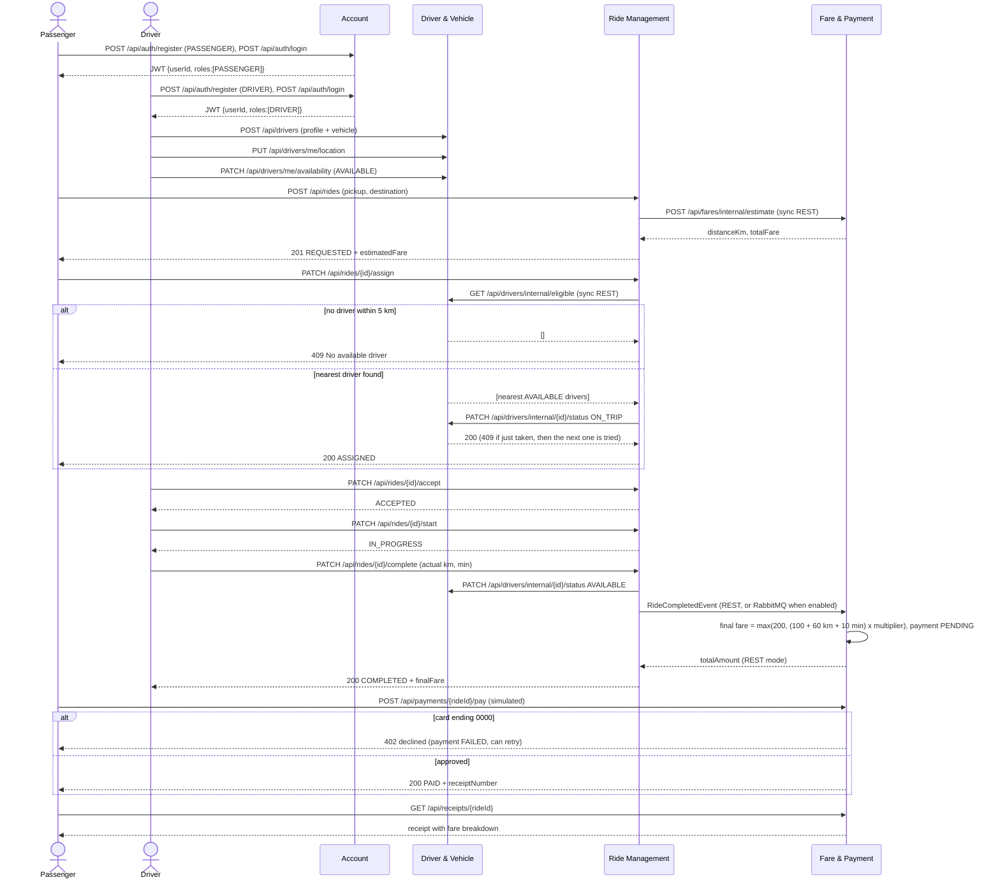

# RideLink Sequence Diagram — Full Ride Lifecycle

Paste the diagram into [mermaid.live](https://mermaid.live) to render and export it for the report.
The Postman collection `postman/RideLink.postman_collection.json` runs this exact flow.

